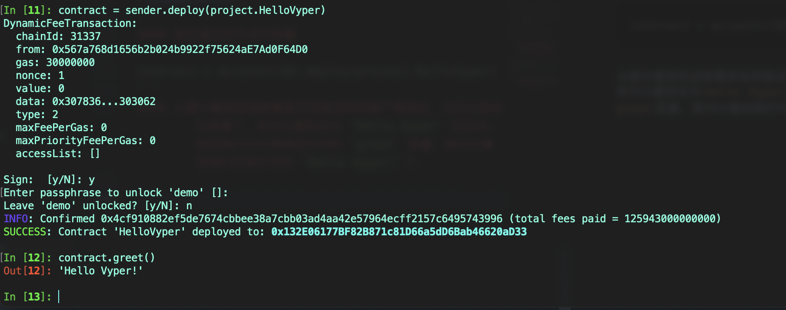

# Vyper入门: 1. HelloVyper

## Vyper简述
#### Vyper 是一种面向合约的类似于 Python 的编程语言，也是为`EVM`设计的。 Vyper和Solidity有不同的设计哲学和目标。Vyper的设计重点是简单性和安全性，而Solidity则提供了更多的灵活性和复杂的特性。

## 开发环境
#### 不同于Solidity可以直接使用 `Remix` 进行开发，`Remix`仅支持Vyper `0.2.16` 以下的版本。要进行Vyper开发，需要在本地安装`Vyper`和`ApeWorx`。

### 安装Vyper
#### 你可以使用 `Docker` 和 `PIP` 安装Vyper，在这里我们使用 `PIP`进行安装，其他的安装方式可以在 [Vyper官方文档](https://docs.vyperlang.org/en/latest/installing-vyper.html) 中查看。

```
pip3 install vyper
```

#### 或者
```
pip3 install vyper==0.3.9
```
#### 安装的vyper版本根据当前你的Python版本来决定

### 安装ApeWorX
#### ApeWorX是一个智能合约开发框架，完全兼容Vyper。另外一个兼容Vyper开发的框架 `brownie`已经停止更新，所以我们使用Ape进行开发就足够了
#### 官网: [ApeWorX](https://apeworx.io)

```
pip3 install eth-ape
```

#### **安装插件**
#### 开发常用的插件是 `hardhat` 和 `alchemy`，使用`alchemy` 需要在本地设置你的 `key`，具体配置可以点 [这里](https://academy.apeworx.io/articles/account-tutorial)
```
ape plugins install hardhat, alchemy
```

#### **初始化项目**
```
ape init
```

#### **ape-config.yaml 文件示例配置**
#### 以下是 `ethereum-fork` 为例的简单配置信息
```
name: HelloVyper

plugins:
  - name: alchemy
  - name: etherscan
  - name: hardhat

default_ecosystem: ethereum

ethereum:
  default_network: mainnet-fork
  mainnet_fork:
    default_provider: hardhat
    transaction_acceptance_timeout: 99999999
  mainnet:
    transaction_acceptance_timeout: 99999999

hardhat:
  port: auto
  fork:
    ethereum:
      mainnet:
        upstream_provider: alchemy
        enable_hardhat_deployments: true

test:
  mnemonic: test test test test test test test test test test test junk
  number_of_accounts: 5

```

#### 如果编译时出现 `PUSH0` 报错信息，这是因为 `EVM` 版本问题，只需要在 `ape-config` 文件中加入
```
vyper:
  evm_version: paris
```

## 编写第一个Vyper合约

#### 只需有简单的几行代码

```
# @version 0.3.9

greet: public(String[12])

@payable
@external
def __init__():
	self.greet = "Hello Vyper!"
```

#### 我们拆分示例，分析Vyper代码的结构
#### 1. 第一行是声明使用的Vyper版本。这行代码的意思是指定代码应该使用的Vyper编译器版本为 `0.3.9`，只有编译器版本为 `0.3.9` 时才能编译成功。
#### 你也可以这样声明:
```
# @version >=0.3.9
```
#### 这个代表编译器版本需要大于等于 `0.3.9`

#### 2. 第二行是声明一个公共变量greet。`public` 关键字意味着这个变量可以被链上的任何人访问。String[12]指定了变量类型，即长度为12个字符的字符串。Vyper要求为字符串指定固定的长度，这是为了确保智能合约在区块链上运行时的效率和安全性，同时减少资源消耗和潜在的安全风险。

```
greet: public(String[12])
```

#### 3. `@payable` 和 `@external`是两种装饰器，`payable` 表示这个函数可以接收ETH,在构造函数中，使用它可以节省部署的`GAS`费用; `external`表示这个函数可以从合约外部调用，在构造函数中是必须的。
```
@payable
@external
```

#### 4. `__init__` 是智能合约的构造函数。在Vyper中，构造函数用 `__init__` 表示。这个函数在合约部署到区块链时自动执行一次。
```
def __init__():
```

#### 5. 这行代码设置了前面声明的 `greet` 变量的初始值。这意味着当合约被部署时，`greet` 的值将被设置为字符串 `Hello Vyper!`
```
self.greet = "Hello Vyper!"
```

## 编译并部署代码
#### 打开控制台进入合约文件夹下输入命令进行编译
```
ape compile
```


#### 编译完成后，我们进入 `ape` 控制台开始在`ethereum-fork` 上部署合约，`ethereum-fork`是1:1复制以太坊主网的虚拟网络，以太坊上所有的合约和账户都可以进行使用，这在测试合约方面极为方便，在之后的教程中会进行详细介绍，你也可以配置 `ape-config` 使用其他的网络进行部署。

#### ape框架会给你分配很多个测试账户，你需要导入它。因为我们目前在fork网络中，还需要自行添加ETH数量用来部署合约
```
from ape import accounts

# 这边我们添加了一个单位的ETH，注意使用样式 int(1e18)
accounts[0].balance += int(1e18)
```


#### 现在通过命令进行部署
```
contract = accounts[0].deploy(project.HelloVyper)
```
#### 从图中看到完成部署签名和验证你的账户密码后，合约已经成功部署了，你可以看到名为 `Hello Vyper` 的合约。然后我们可以调用合约中的 `greet` 变量，就可以看到我们代码中写的 `Hello Vyper!`了。


## 总结
#### 入门第一站，我们介绍了Vyper开发环境和如何部署第一个Vyper合约 `HelloVyper`。下面我们将继续深入了解Vyper。
